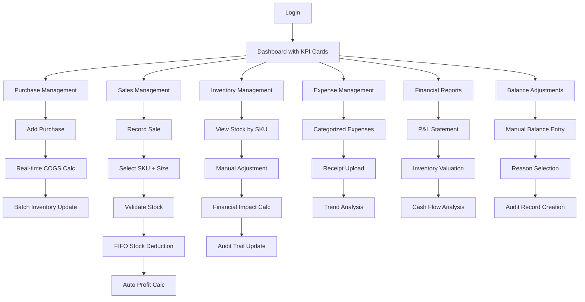

# The Dozing Duchess - Inventory Management System
## Product Requirements Document

## 1. Product Overview

**The Dozing Duchess** is a comprehensive inventory management system designed for pajama e-commerce businesses that source products from Chinese marketplaces and sell locally in Indonesia. The system tracks purchases in CNY, manages logistics costs, handles currency conversion to IDR, and provides complete visibility into inventory, sales, expenses, and profitability with elegant UI design and professional number formatting.

The system solves the complex challenge of managing multi-currency purchases, logistics cost allocation, COGS averaging for repeat orders, and provides real-time insights into business profitability for small to medium e-commerce operators. **Successfully deployed to Vercel** with full production capabilities.

Target market: Small to medium pajama retailers who import from China and need efficient inventory and financial tracking to maximize profitability. The system features an elegant pink/purple gradient theme with glass-morphism effects and Indonesian locale number formatting.

## 2. Core Features

### 2.1 User Roles

| Role | Registration Method | Core Permissions |
|------|---------------------|------------------|
| Admin | Direct database entry (username: admin, password: admin) | Full system access, can manage all modules |

### 2.2 Feature Module

Our pajama inventory management system consists of the following main pages:

1. **Dashboard**: Key metrics overview, low stock alerts, profit summary, recent activities
2. **Purchase Management**: Record Chinese marketplace purchases, logistics fee allocation, COGS calculation
3. **Inventory Management**: Stock tracking by SKU, manual adjustments, stock movement history
4. **Sales Management**: Record marketplace sales, invoice tracking, stock deduction
5. **Expense Management**: Track business expenses, manual adjustments, expense categorization
6. **Reports & Analytics**: Income vs expense analysis, profit margins, stock reports, visual charts
7. **Settings**: Exchange rates, marketplace configuration, low stock thresholds
8. **Login**: Simple authentication system

### 2.3 Page Details

| Page Name | Module Name | Feature description |
|-----------|-------------|---------------------|
| Dashboard | Overview Cards | Display total inventory value, monthly profit, low stock alerts, recent transactions with elegant KPI cards |
| Dashboard | Quick Actions | Fast access buttons with icons: add purchase, record sale, stock adjustment, balance adjustment |
| Dashboard | Charts Section | Interactive charts: monthly profit/loss, inventory turnover, top-selling products with drill-down capability |
| Purchase Management | Purchase Entry | Record product URL, variant, size, quantity, CNY price, logistics fee, exchange rate with smart form validation |
| Purchase Management | Purchase History | Elegant data table with sorting, filtering, pagination. Search by date, product, supplier |
| Purchase Management | COGS Calculator | Real-time calculation display with breakdown: CNY price + logistics + exchange rate = total COGS |
| Inventory Management | Stock Overview | Advanced data table showing current stock by SKU with available quantity, average COGS, total value |
| Inventory Management | Stock Adjustment | Manual stock reduction with financial impact calculation and reason tracking (defect, customs, damage) |
| Inventory Management | Stock Movement History | Detailed audit trail with FIFO batch tracking and financial impact per movement |
| Inventory Management | Low Stock Alerts | Smart notification system with configurable thresholds and reorder suggestions |
| Sales Management | SKU Selection | Dropdown/search to select specific variant + size combinations with real-time stock availability |
| Sales Management | Sales Entry | Record sales with SKU selection, quantity validation, auto-calculated profit based on FIFO COGS |
| Sales Management | Sales History | Comprehensive sales table with profit margins, marketplace breakdown, and export functionality |
| Sales Management | Profit Analysis | Interactive charts showing profit trends, margin analysis per SKU, and profitability insights |
| Expense Management | Expense Entry | Categorized expense entry with receipt upload and approval workflow |
| Expense Management | Expense Categories | Dynamic category management with budget tracking and variance analysis |
| Expense Management | Expense Reports | Visual expense breakdown with trend analysis and budget vs actual comparisons |
| Financial Reports | Income Statement | Professional P&L report with revenue, COGS, expenses, and net profit calculations |
| Financial Reports | Balance Adjustments | Manual balance adjustment feature for refunds, capital injection, bank fees, currency gains/losses |
| Financial Reports | Cash Flow | Real-time cash flow tracking with balance history and projection modeling |
| Financial Reports | Inventory Valuation | Current inventory value with aging analysis and slow-moving stock identification |
| Settings | Exchange Rates | Historical exchange rate management with automatic rate suggestions |
| Settings | Marketplace Config | Dynamic marketplace configuration with commission rate settings |
| Settings | Stock Thresholds | Intelligent threshold setting with seasonal adjustment capabilities |
| Authentication | Login | Secure admin authentication with session management and password policies |

## 3. Core Process

### Admin User Flow
1. **Login** → Dashboard overview with KPI cards and quick actions
2. **Purchase Flow**: Add Purchase → Enter product details → Real-time COGS calculation → Automatic inventory update with batch tracking
3. **Sales Flow**: Record Sale → **Select specific SKU (variant + size)** → Validate stock availability → Enter quantity/price → Auto-deduct using FIFO → Calculate profit
4. **Inventory Management**: View stock by SKU → Manual adjustments with financial impact → Track movements with audit trail
5. **Stock Adjustment Flow**: Select SKU → Choose adjustment type → Enter quantity and reason → **Calculate financial impact** → Update inventory and financials
6. **Balance Adjustment Flow**: Access financial reports → Manual balance adjustment → Select reason (refund/injection/fees) → Enter amount → Create audit record
7. **Expense Tracking**: Add categorized expenses → Upload receipts → View trend analysis
8. **Financial Analysis**: View comprehensive P&L → Analyze profit trends → Export professional reports

## 4. User Interface Design

### 4.1 Design Style

**Color Scheme:**
- Primary: Elegant Pink (#E91E63) to Purple (#9C27B0) gradient
- Secondary: Soft Rose (#FCE4EC) and Lavender (#F3E5F5)
- Accent: Rose Gold (#E8B4CB) and Deep Purple (#673AB7)
- Background: Premium White (#FAFAFA) with subtle gradient overlays
- Success: Emerald Green (#4CAF50)
- Warning: Amber (#FF9800)
- Error: Coral Red (#F44336)
- Text: Charcoal (#424242) with proper contrast ratios

**Typography:**
- Primary Font: Inter or Poppins for modern elegance
- Display: 32px, 28px, 24px with semi-bold weight
- Headings: 20px, 18px, 16px with medium weight
- Body Text: 14px with regular weight (line-height: 1.6)
- Small Text: 12px for labels and captions
- Font smoothing: -webkit-font-smoothing: antialiased

**Component Style:**
- **Buttons**: Elevated design with gradient backgrounds, rounded corners (12px), subtle shadows
- **Cards**: Clean white background, 16px border radius, elegant drop shadows (0 4px 20px rgba(0,0,0,0.08))
- **Forms**: Floating labels, smooth focus transitions, validation with elegant error states
- **Tables**: Zebra striping, hover effects, sortable headers with icons
- **Charts**: Smooth animations, gradient fills, interactive tooltips
- **Icons**: Outlined style from Material Design Icons or Lucide React
- **Logo**: Circular bubble design with Pajama icon (restored from original design)

**Layout & Spacing:**
- **Grid System**: 12-column responsive grid with 24px gutters
- **Sidebar**: Collapsible navigation with smooth animations (280px expanded, 64px collapsed)
- **Content Area**: Maximum width 1200px with proper margins
- **Spacing Scale**: 4px, 8px, 16px, 24px, 32px, 48px, 64px
- **Component Spacing**: Consistent 16px padding for cards, 24px for sections
- **Navbar**: Glass-morphism effect with elegant spacing, removed search/notification features

**Number Formatting:**
- **Indonesian Locale**: All numbers formatted with thousand separators (1.234.567)
- **Currency**: Consistent IDR symbol with proper formatting (Rp 1.234.567)
- **Utility Functions**: formatNumber(), formatPrice(), formatQuantity() for consistency
- **Components Updated**: Dashboard, Inventory, Sales, Expenses, Purchase Orders, Financial Journal

### 4.2 Page Design Overview

| Page Name | Module Name | UI Elements |
|-----------|-------------|-------------|
| Dashboard | KPI Cards | Elegant gradient cards with animated counters, icons, and trend indicators (↗️↘️) |
| Dashboard | Quick Actions | Floating action buttons with smooth hover effects, tooltips, and icon animations |
| Dashboard | Interactive Charts | Chart.js with custom pink/purple gradients, smooth transitions, drill-down capability |
| Purchase Management | Smart Purchase Form | Multi-step form with progress indicator, real-time COGS calculation, validation feedback |
| Purchase Management | Advanced Data Table | Material-UI DataGrid with sorting, filtering, pagination, row selection, export to Excel/PDF |
| Inventory Management | SKU Cards Grid | Responsive card layout with stock status badges, low stock warnings, quick action buttons |
| Inventory Management | Stock Adjustment Modal | Elegant modal with financial impact calculator, reason dropdown, confirmation dialog |
| Sales Management | **SKU Selector** | **Searchable dropdown with variant + size combinations, real-time stock availability display** |
| Sales Management | Sales Entry Form | Auto-completing fields, quantity validation against stock, profit calculation preview |
| Sales Management | Sales Analytics | Interactive profit charts, margin analysis, marketplace performance comparison |
| Expense Management | Expense Entry | Drag-drop receipt upload, category autocomplete, amount formatting with currency |
| Expense Management | Expense Dashboard | Visual spending breakdown, budget vs actual charts, category trend analysis |
| **Financial Reports** | **Balance Adjustment Panel** | **Dedicated section for manual balance adjustments with reason tracking and audit trail** |
| Financial Reports | P&L Statement | Professional financial report layout with expandable sections and export functionality |
| Financial Reports | Cash Flow Visualization | Timeline chart showing money in/out, balance projections, trend analysis |
| Settings | Configuration Panels | Tabbed interface with form sections, real-time validation, save confirmations |
| Authentication | Login Interface | **Centered card with flexbox layout**, gradient background, smooth animations, circular bubble logo with Pajama icon |

### 4.3 Responsiveness

The system is designed as **desktop-first** with elegant mobile adaptation:

- **Desktop (1200px+)**: Full sidebar navigation, multi-column dashboard, comprehensive data tables with advanced filtering
- **Tablet (768px-1199px)**: Collapsible sidebar with icons, responsive card grids, touch-optimized controls
- **Mobile (320px-767px)**: Bottom navigation bar, single-column layouts, swipe gestures, optimized forms

**Touch Optimization & Accessibility:**
- Minimum 44px touch targets with proper spacing
- Swipe gestures for table navigation and card interactions
- Pull-to-refresh functionality for data updates
- Keyboard navigation support for all interactive elements
- ARIA labels and proper semantic HTML structure
- High contrast mode support
- Focus indicators with custom pink/purple styling

**Performance Considerations:**
- Lazy loading for large data tables
- Progressive image loading for receipts/attachments
- Skeleton loading states with branded styling
- Optimized bundle splitting for faster initial load
- Service worker for offline capability (view-only mode)

## 5. Critical Business Logic Features

### 5.1 Enhanced Sales Process with SKU Selection
**User Story**: As an admin, I need to select specific product variants and sizes when recording sales, so I can accurately track inventory by SKU.

**Acceptance Criteria**:
- Sales form displays searchable dropdown with format: "Product Name - Variant - Size (Available: X units)"
- Real-time stock availability check prevents overselling
- Auto-calculation of profit based on FIFO COGS from oldest purchase batches
- Validation prevents sale if insufficient stock available
- Clear display of current COGS and calculated profit margin

### 5.2 Manual Stock Adjustment with Financial Impact
**User Story**: As an admin, I need to manually reduce stock for defects or customs seizure, and understand the financial impact of these adjustments.

**Acceptance Criteria**:
- Stock adjustment form with reason selection: "Defect", "Customs Seizure", "Damage", "Loss", "Other"
- Financial impact calculation showing: "Reducing X units will write off $Y in inventory value"
- Two adjustment options:
  1. **Write-off as Loss**: Create expense entry for the inventory value lost
  2. **Adjust Remaining COGS**: Distribute the lost value across remaining stock (increase average COGS)
- Audit trail showing: date, reason, quantity, financial impact, and method chosen
- FIFO deduction: Remove from oldest purchase batches first

### 5.3 Manual Balance Adjustments
**User Story**: As an admin, I need to manually adjust cash balance for various business reasons like refunds, capital injection, or bank fees.

**Acceptance Criteria**:
- Dedicated "Balance Adjustments" section in Financial Reports
- Adjustment types with predefined reasons:
  - **Logistics Refund**: Money back from shipping companies
  - **Capital Injection**: Owner adding money to business
  - **Bank Fees**: Banking charges and transaction fees
  - **Currency Exchange**: Gains/losses from currency conversion
  - **Supplier Refund**: Refunds from Chinese suppliers
  - **Other**: Custom reason with description
- Each adjustment creates audit record with: date, amount, type, reason, description
- Balance history showing running total with adjustment details
- Monthly summary of adjustments by category

### 5.4 Enhanced Financial Tracking
**Business Logic for Profit Calculation**:
- **Revenue**: Total sales amount from marketplace transactions
- **COGS**: Cost of goods sold using FIFO method from purchase batches
- **Expenses**: Business expenses (ads, office supplies, etc.) + stock write-offs
- **Balance Adjustments**: Separate tracking (not included in profit calculation)
- **Net Profit**: Revenue - COGS - Expenses

## 6. Additional Features to Consider

Based on your business model, here are additional features that could enhance your system:

### 5.1 Advanced Features
- **Batch Import**: Import multiple products from CSV/Excel files
- **Barcode Generation**: Generate SKU barcodes for physical inventory management
- **Supplier Management**: Track multiple Chinese suppliers with contact details and performance metrics
- **Product Photos**: Store and manage product images for better identification
- **Seasonal Analysis**: Track sales patterns by season for better purchasing decisions

### 5.2 Business Intelligence
- **Profit Margin Alerts**: Notifications when profit margins fall below thresholds
- **Demand Forecasting**: Predict future stock needs based on sales history
- **ABC Analysis**: Categorize products by sales volume and profitability
- **Competitor Price Tracking**: Monitor competitor prices for better pricing strategies

### 5.3 Operational Efficiency
- **Automated Reorder Points**: Automatic purchase suggestions when stock hits minimum levels
- **Shipping Integration**: Track shipments from China with estimated arrival dates
- **Quality Control**: Track defect rates by supplier and product
- **Customer Returns**: Manage returns and their impact on inventory

### 5.4 Financial Management
- **Tax Calculation**: Automatic tax calculations for Indonesian regulations
- **Cash Flow Projection**: Predict future cash flow based on current trends
- **Currency Hedging**: Track exchange rate risks and hedging opportunities
- **Loan/Investment Tracking**: Monitor business financing and investor returns

### 5.5 Integration Possibilities
- **Marketplace APIs**: Direct integration with Tokopedia, Shopee, Lazada for automated sales import
- **Accounting Software**: Export data to accounting systems like Jurnal or Accurate
- **Payment Gateway**: Track payment methods and processing fees
- **Shipping Partners**: Integration with JNE, J&T, SiCepat for shipping cost calculation

## 7. Deployment & Current Status

### 7.1 Production Deployment
**The Dozing Duchess** is successfully deployed to **Vercel** with the following configuration:
- **Live URL**: Available on Vercel's production environment
- **Deployment Platform**: Vercel with automatic deployments
- **Build Configuration**: TypeScript + Vite build system
- **Environment**: Production-ready with Supabase integration

### 7.2 Technical Implementation Status
**✅ Completed Features:**
- Full-stack React + TypeScript + Supabase application
- Complete inventory management system
- User authentication and session management
- Dashboard with KPI cards and analytics
- Purchase order management with COGS calculation
- Inventory tracking with low stock alerts
- Sales management with profit calculation
- Expense tracking and categorization
- Financial reporting and balance adjustments

**✅ Recent Enhancements (Deployed):**
- **UI/UX Improvements**: Centered login form, restored circular bubble logo, enhanced navbar with glass-morphism
- **Number Formatting**: Indonesian locale with thousand separators across all components
- **Performance**: Optimized build and deployment configuration
- **Responsive Design**: Mobile-first approach with touch optimization

### 7.3 Production Environment
- **Frontend**: React 18 + TypeScript + Material-UI 5
- **Backend**: Supabase (Authentication + PostgreSQL + Real-time)
- **Deployment**: Vercel with automatic CI/CD
- **Database**: Supabase PostgreSQL with Row Level Security
- **Authentication**: Supabase Auth with admin credentials
- **Styling**: Material-UI with custom pink/purple theme

### 7.4 Future Enhancement Opportunities
Based on the current production system, potential areas for expansion include:
- Marketplace API integrations (Tokopedia, Shopee, Lazada)
- Advanced analytics and business intelligence
- Automated reorder suggestions
- Multi-user role management
- Mobile application development
- Advanced reporting and export capabilities