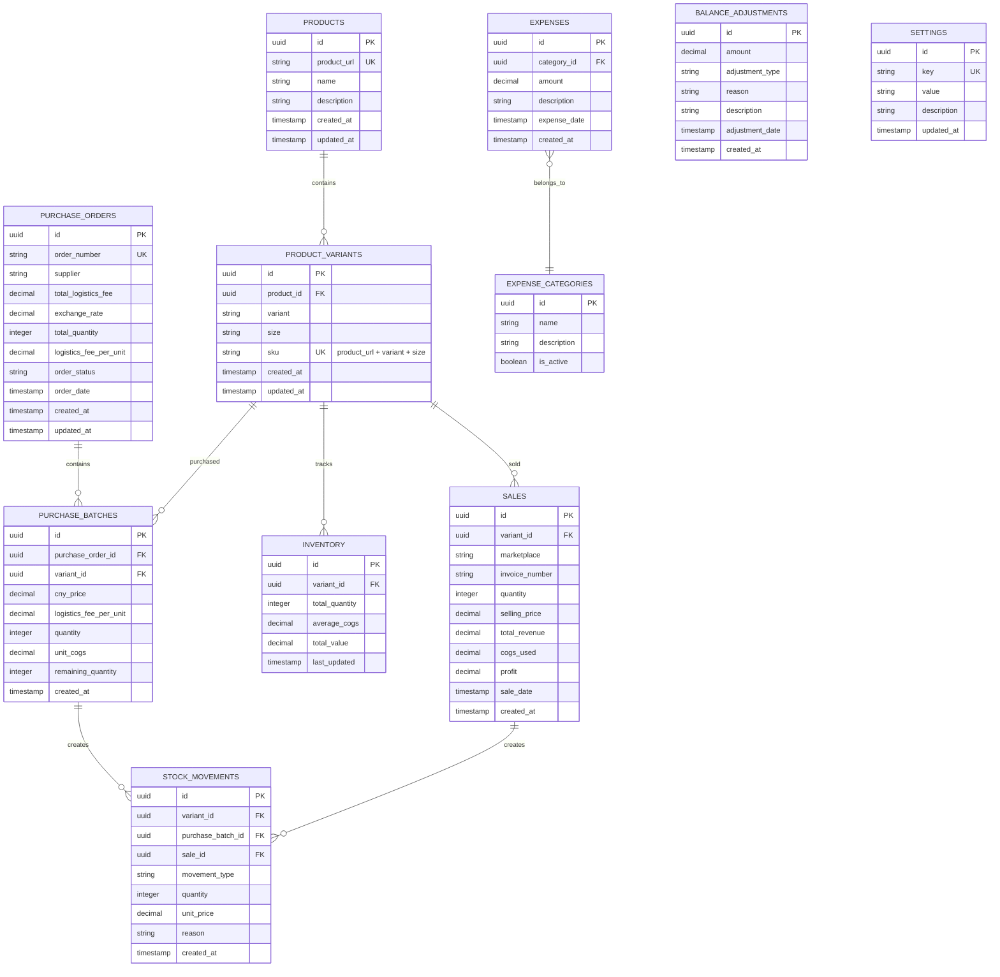

# The Dozing Duchess - Inventory Management System
## Technical Architecture Document

## 1. Architecture Design


## 2. Technology Description

**Frontend Stack (Deployed on Vercel):**
- **React@18** + **TypeScript** for type-safe component development
- **Material-UI@5** with custom pink/purple gradient theme
- **Chart.js@4** for financial analytics and reporting
- **React Router@6** for client-side routing
- **React Hook Form@7** for form management and validation
- **Vite** for fast development and optimized production builds

**Backend Services:**
- **Supabase** (Authentication + PostgreSQL Database + Real-time subscriptions)
- **Row Level Security (RLS)** for data protection
- **Supabase Edge Functions** for server-side logic

**Deployment & Infrastructure:**
- **Vercel** for frontend hosting with automatic deployments
- **Vercel Edge Network** for global CDN and performance
- **Environment Variables** securely managed in Vercel dashboard

**Styling & UI:**
- **Material-UI** with custom pink/purple theme + CSS-in-JS
- **Glass-morphism effects** for modern navbar design
- **Circular bubble logo** with Pajama icon (restored design)
- **Indonesian locale number formatting** with thousand separators

**State Management & Utils:**
- **React Context API** + Custom hooks for global state
- **Custom utility functions** for number formatting (formatNumber, formatPrice, formatQuantity)
- **Real-time data synchronization** via Supabase subscriptions

## 3. Route Definitions

| Route                  | Purpose                                                         |
| ---------------------- | --------------------------------------------------------------- |
| /login                 | Authentication page for admin login                             |
| /                      | Dashboard with key metrics, alerts, and quick actions           |
| /products              | Product catalog management - add/edit products and variants     |
| /products/add          | Form to add new products with variants and sizes                |
| /purchase-orders       | Purchase order management - view all orders and their status    |
| /purchase-orders/add   | Form to create new purchase order with multiple products        |
| /purchase-orders/:id   | View/edit specific purchase order details                       |
| /inventory             | Inventory overview with stock levels by SKU                     |
| /inventory/adjustments | Manual stock adjustments and movement history                   |
| /inventory/batches     | View stock by purchase batches for FIFO tracking                |
| /sales                 | Sales management - record marketplace sales                     |
| /sales/add             | Form to record new sale with SKU selection and stock validation |
| /expenses              | Expense management and categorization                           |
| /expenses/add          | Form to add new business expenses                               |
| /balance               | Manual balance adjustments for refunds, capital injection, etc. |
| /reports               | Analytics dashboard with charts and financial reports           |
| /reports/profit        | Detailed profit analysis and margin calculations                |
| /reports/stock         | Stock reports and low inventory alerts                          |
| /settings              | System configuration - exchange rates, thresholds               |
| /settings/marketplace  | Marketplace configuration for sales dropdown                    |

## 4. API Definitions

Since this system uses Supabase as the backend, all API interactions are handled through the Supabase client SDK. The main data operations include:

### 4.1 Core Data Operations

**Authentication**

```typescript
// Login
const { data, error } = await supabase.auth.signInWithPassword({
  email: 'admin@admin.com',
  password: 'admin'
})

// Logout
const { error } = await supabase.auth.signOut()
```

**Product and Variant Operations**

```typescript
// Add Product
const { data, error } = await supabase
  .from('products')
  .insert({
    product_url: string,
    name: string,
    description?: string,
    brand?: string
  })

// Add Product Variant
const { data, error } = await supabase
  .from('product_variants')
  .insert({
    product_id: string,
    variant: string,
    size: string,
    color?: string,
    weight?: number
  })

// Get Products with Variants
const { data, error } = await supabase
  .from('products')
  .select(`
    *,
    product_variants (
      *,
      inventory (*)
    )
  `)
```

**Purchase Order Operations**

```typescript
// Create Purchase Order
const { data: order, error } = await supabase
  .from('purchase_orders')
  .insert({
    order_number: string,
    supplier: string,
    total_logistics_fee: number,
    exchange_rate: number,
    order_date: string
  })
  .select()
  .single()

// Add Products to Purchase Order
const { data, error } = await supabase
  .from('purchase_batches')
  .insert([
    {
      purchase_order_id: order.id,
      variant_id: string,
      cny_price: number,
      logistics_fee_per_unit: number, // calculated from order total
      quantity: number,
      unit_cogs: number // (cny_price + logistics_fee_per_unit) * exchange_rate
    }
  ])

// Get Purchase Orders with Items
const { data, error } = await supabase
  .from('purchase_orders')
  .select(`
    *,
    purchase_batches (
      *,
      product_variants (
        *,
        products (*)
      )
    )
  `)
  .order('created_at', { ascending: false })

// Update Order Total Quantity (trigger will calculate logistics_fee_per_unit)
const { data, error } = await supabase
  .from('purchase_orders')
  .update({ 
    total_quantity: totalQty 
  })
  .eq('id', orderId)
```

**Inventory Operations**

```typescript
// Get Inventory with Alerts
const { data, error } = await supabase
  .from('inventory_with_alerts')
  .select('*')
  .order('is_low_stock', { ascending: false })

// Get Stock by SKU
const { data, error } = await supabase
  .from('inventory_with_alerts')
  .select('*')
  .eq('sku', sku)
  .single()

// Manual Stock Adjustment (using RPC function)
const { data, error } = await supabase
  .rpc('deduct_stock_fifo', {
    p_variant_id: variantId,
    p_quantity: adjustmentQuantity,
    p_reason: 'Manual adjustment - defect/customs'
  })

// Get Stock by Batches
const { data, error } = await supabase
  .from('stock_by_batches')
  .select('*')
  .eq('sku', sku)
```

**Sales Operations**

```typescript
// Record Sale (COGS calculated automatically)
const { data, error } = await supabase
  .from('sales')
  .insert({
    variant_id: string,
    marketplace: string,
    invoice_number: string,
    quantity: number,
    selling_price: number
    // cogs_used and profit calculated automatically by trigger
  })

// Get Sales History
const { data, error } = await supabase
  .from('sales')
  .select(`
    *,
    product_variants (
      sku,
      variant,
      size,
      products (name)
    )
  `)
  .order('created_at', { ascending: false })
```

**Expense Operations**

```typescript
// Add Expense
const { data, error } = await supabase
  .from('expenses')
  .insert({
    category: string,
    amount: number,
    description: string,
    expense_date: string
  })
```

## 5. Data Model

### 5.1 Data Model Definition



### 5.2 Data Definition Language

**Products Table (Base Product Information)**

```sql
-- Create products table
CREATE TABLE products (
    id UUID PRIMARY KEY DEFAULT gen_random_uuid(),
    product_url TEXT UNIQUE NOT NULL,
    name VARCHAR(200) NOT NULL,
    description TEXT,
    brand VARCHAR(100),
    created_at TIMESTAMP WITH TIME ZONE DEFAULT NOW(),
    updated_at TIMESTAMP WITH TIME ZONE DEFAULT NOW()
);

-- Create indexes
CREATE INDEX idx_products_url ON products(product_url);
CREATE INDEX idx_products_brand ON products(brand);

-- RLS policies
ALTER TABLE products ENABLE ROW LEVEL SECURITY;
GRANT SELECT ON products TO anon;
GRANT ALL PRIVILEGES ON products TO authenticated;
```

**Product Variants Table (Variant + Size Combinations)**

```sql
-- Create product variants table
CREATE TABLE product_variants (
    id UUID PRIMARY KEY DEFAULT gen_random_uuid(),
    product_id UUID REFERENCES products(id) ON DELETE CASCADE,
    variant VARCHAR(100) NOT NULL,
    size VARCHAR(20) NOT NULL,
    sku VARCHAR(150) GENERATED ALWAYS AS (variant || '-' || size) STORED,
    color VARCHAR(50),
    weight DECIMAL(8,3),
    is_active BOOLEAN DEFAULT true,
    created_at TIMESTAMP WITH TIME ZONE DEFAULT NOW(),
    updated_at TIMESTAMP WITH TIME ZONE DEFAULT NOW(),
    UNIQUE(product_id, variant, size)
);

-- Create indexes
CREATE UNIQUE INDEX idx_variants_sku ON product_variants(sku);
CREATE INDEX idx_variants_product_id ON product_variants(product_id);
CREATE INDEX idx_variants_variant ON product_variants(variant);
CREATE INDEX idx_variants_active ON product_variants(is_active);

-- RLS policies
ALTER TABLE product_variants ENABLE ROW LEVEL SECURITY;
GRANT SELECT ON product_variants TO anon;
GRANT ALL PRIVILEGES ON product_variants TO authenticated;
```

**Purchase Orders Table**

```sql
-- Create purchase orders table
CREATE TABLE purchase_orders (
    id UUID PRIMARY KEY DEFAULT gen_random_uuid(),
    order_number VARCHAR(100) UNIQUE NOT NULL,
    supplier VARCHAR(200) NOT NULL,
    total_logistics_fee DECIMAL(10,2) NOT NULL DEFAULT 0,
    exchange_rate DECIMAL(10,4) NOT NULL,
    total_quantity INTEGER NOT NULL DEFAULT 0,
    logistics_fee_per_unit DECIMAL(10,4) GENERATED ALWAYS AS (
        CASE 
            WHEN total_quantity > 0 THEN total_logistics_fee / total_quantity 
            ELSE 0 
        END
    ) STORED,
    order_status VARCHAR(20) DEFAULT 'pending' CHECK (order_status IN ('pending', 'completed', 'cancelled')),
    order_date DATE DEFAULT CURRENT_DATE,
    created_at TIMESTAMP WITH TIME ZONE DEFAULT NOW(),
    updated_at TIMESTAMP WITH TIME ZONE DEFAULT NOW()
);

-- Create indexes
CREATE INDEX idx_purchase_orders_order_number ON purchase_orders(order_number);
CREATE INDEX idx_purchase_orders_order_date ON purchase_orders(order_date DESC);
CREATE INDEX idx_purchase_orders_status ON purchase_orders(order_status);

-- RLS policies
ALTER TABLE purchase_orders ENABLE ROW LEVEL SECURITY;
GRANT SELECT ON purchase_orders TO anon;
GRANT ALL PRIVILEGES ON purchase_orders TO authenticated;
```

**Purchase Batches Table (Each Purchase with Specific Costs)**

```sql
-- Create purchase batches table
CREATE TABLE purchase_batches (
    id UUID PRIMARY KEY DEFAULT gen_random_uuid(),
    purchase_order_id UUID REFERENCES purchase_orders(id) ON DELETE CASCADE,
    variant_id UUID REFERENCES product_variants(id) ON DELETE CASCADE,
    cny_price DECIMAL(10,2) NOT NULL,
    logistics_fee_per_unit DECIMAL(10,4) NOT NULL,
    quantity INTEGER NOT NULL CHECK (quantity > 0),
    unit_cogs DECIMAL(10,2) NOT NULL,
    remaining_quantity INTEGER NOT NULL DEFAULT 0,
    created_at TIMESTAMP WITH TIME ZONE DEFAULT NOW()
);

-- Create indexes
CREATE INDEX idx_purchase_batches_order_id ON purchase_batches(purchase_order_id);
CREATE INDEX idx_purchase_batches_variant_id ON purchase_batches(variant_id);
CREATE INDEX idx_purchase_batches_remaining ON purchase_batches(remaining_quantity);

-- RLS policies
ALTER TABLE purchase_batches ENABLE ROW LEVEL SECURITY;
GRANT SELECT ON purchase_batches TO anon;
GRANT ALL PRIVILEGES ON purchase_batches TO authenticated;
```

**Inventory Table (Current Stock Summary per Variant)**

```sql
-- Create inventory table
CREATE TABLE inventory (
    id UUID PRIMARY KEY DEFAULT gen_random_uuid(),
    variant_id UUID REFERENCES product_variants(id) ON DELETE CASCADE,
    total_quantity INTEGER NOT NULL DEFAULT 0,
    average_cogs DECIMAL(10,2) NOT NULL DEFAULT 0,
    total_value DECIMAL(12,2) GENERATED ALWAYS AS (total_quantity * average_cogs) STORED,
    low_stock_threshold INTEGER DEFAULT 5,
    last_updated TIMESTAMP WITH TIME ZONE DEFAULT NOW(),
    UNIQUE(variant_id)
);

-- Create indexes
CREATE INDEX idx_inventory_variant_id ON inventory(variant_id);
CREATE INDEX idx_inventory_quantity ON inventory(total_quantity);
CREATE INDEX idx_inventory_low_stock ON inventory(total_quantity, low_stock_threshold);

-- RLS policies
ALTER TABLE inventory ENABLE ROW LEVEL SECURITY;
GRANT SELECT ON inventory TO anon;
GRANT ALL PRIVILEGES ON inventory TO authenticated;
```

**Stock Movements Table (FIFO Tracking)**

```sql
-- Create stock movements table
CREATE TABLE stock_movements (
    id UUID PRIMARY KEY DEFAULT gen_random_uuid(),
    variant_id UUID REFERENCES product_variants(id) ON DELETE CASCADE,
    batch_id UUID REFERENCES purchase_batches(id) ON DELETE SET NULL,
    sale_id UUID REFERENCES sales(id) ON DELETE SET NULL,
    movement_type VARCHAR(20) NOT NULL CHECK (movement_type IN ('purchase', 'sale', 'adjustment_in', 'adjustment_out')),
    quantity INTEGER NOT NULL,
    unit_price DECIMAL(10,2) NOT NULL,
    reason TEXT,
    created_at TIMESTAMP WITH TIME ZONE DEFAULT NOW()
);

-- Create indexes
CREATE INDEX idx_movements_variant_id ON stock_movements(variant_id);
CREATE INDEX idx_movements_batch_id ON stock_movements(batch_id);
CREATE INDEX idx_movements_created_at ON stock_movements(created_at DESC);
CREATE INDEX idx_movements_type ON stock_movements(movement_type);

-- RLS policies
ALTER TABLE stock_movements ENABLE ROW LEVEL SECURITY;
GRANT SELECT ON stock_movements TO anon;
GRANT ALL PRIVILEGES ON stock_movements TO authenticated;
```

**Sales Table (Updated for Variant-based Sales)**

```sql
-- Create sales table
CREATE TABLE sales (
    id UUID PRIMARY KEY DEFAULT gen_random_uuid(),
    variant_id UUID REFERENCES product_variants(id) ON DELETE CASCADE,
    marketplace VARCHAR(100) NOT NULL,
    invoice_number VARCHAR(200) NOT NULL,
    quantity INTEGER NOT NULL CHECK (quantity > 0),
    selling_price DECIMAL(10,2) NOT NULL,
    total_revenue DECIMAL(12,2) GENERATED ALWAYS AS (quantity * selling_price) STORED,
    cogs_used DECIMAL(12,2) NOT NULL,
    profit DECIMAL(12,2) GENERATED ALWAYS AS (total_revenue - cogs_used) STORED,
    sale_date DATE DEFAULT CURRENT_DATE,
    created_at TIMESTAMP WITH TIME ZONE DEFAULT NOW()
);

-- Create indexes
CREATE INDEX idx_sales_variant_id ON sales(variant_id);
CREATE INDEX idx_sales_marketplace ON sales(marketplace);
CREATE INDEX idx_sales_sale_date ON sales(sale_date DESC);
CREATE INDEX idx_sales_invoice ON sales(invoice_number);

-- RLS policies
ALTER TABLE sales ENABLE ROW LEVEL SECURITY;
GRANT SELECT ON sales TO anon;
GRANT ALL PRIVILEGES ON sales TO authenticated;
```

**Business Logic Functions and Triggers**

```sql
-- Function to update purchase order totals when batches are added
CREATE OR REPLACE FUNCTION update_purchase_order_totals()
RETURNS TRIGGER AS $$
DECLARE
    order_total_qty INTEGER;
BEGIN
    -- Calculate total quantity for the order
    SELECT COALESCE(SUM(quantity), 0) INTO order_total_qty
    FROM purchase_batches 
    WHERE purchase_order_id = COALESCE(NEW.purchase_order_id, OLD.purchase_order_id);
    
    -- Update the purchase order total quantity
    UPDATE purchase_orders 
    SET total_quantity = order_total_qty,
        updated_at = NOW()
    WHERE id = COALESCE(NEW.purchase_order_id, OLD.purchase_order_id);
    
    RETURN COALESCE(NEW, OLD);
END;
$$ LANGUAGE plpgsql;

-- Function to calculate unit COGS when batch is inserted
CREATE OR REPLACE FUNCTION calculate_batch_cogs()
RETURNS TRIGGER AS $$
DECLARE
    order_exchange_rate DECIMAL(10,4);
    order_logistics_per_unit DECIMAL(10,4);
BEGIN
    -- Get exchange rate and logistics fee per unit from purchase order
    SELECT exchange_rate, logistics_fee_per_unit 
    INTO order_exchange_rate, order_logistics_per_unit
    FROM purchase_orders 
    WHERE id = NEW.purchase_order_id;
    
    -- Calculate unit COGS: (CNY price + logistics per unit) * exchange rate
    NEW.unit_cogs := (NEW.cny_price + order_logistics_per_unit) * order_exchange_rate;
    NEW.logistics_fee_per_unit := order_logistics_per_unit;
    NEW.remaining_quantity := NEW.quantity;
    
    RETURN NEW;
END;
$$ LANGUAGE plpgsql;

-- Function to update inventory after purchase
CREATE OR REPLACE FUNCTION update_inventory_after_purchase()
RETURNS TRIGGER AS $$
BEGIN
    -- Insert or update inventory record
    INSERT INTO inventory (variant_id, total_quantity, average_cogs, last_updated)
    VALUES (
        NEW.variant_id,
        NEW.quantity,
        NEW.unit_cogs,
        NOW()
    )
    ON CONFLICT (variant_id) DO UPDATE SET
        total_quantity = inventory.total_quantity + NEW.quantity,
        average_cogs = (
            (inventory.total_quantity * inventory.average_cogs) + 
            (NEW.quantity * NEW.unit_cogs)
        ) / (inventory.total_quantity + NEW.quantity),
        last_updated = NOW();
    
    -- Create stock movement record
    INSERT INTO stock_movements (
        variant_id, batch_id, movement_type, quantity, unit_price, reason
    ) VALUES (
        NEW.variant_id, NEW.id, 'purchase', NEW.quantity, NEW.unit_cogs, 'Purchase batch added'
    );
    
    RETURN NEW;
END;
$$ LANGUAGE plpgsql;

-- Triggers for purchase batches
CREATE TRIGGER trigger_calculate_batch_cogs
    BEFORE INSERT ON purchase_batches
    FOR EACH ROW
    EXECUTE FUNCTION calculate_batch_cogs();

CREATE TRIGGER trigger_update_inventory_after_purchase
    AFTER INSERT ON purchase_batches
    FOR EACH ROW
    EXECUTE FUNCTION update_inventory_after_purchase();

CREATE TRIGGER trigger_update_purchase_order_totals
    AFTER INSERT OR UPDATE OR DELETE ON purchase_batches
    FOR EACH ROW
    EXECUTE FUNCTION update_purchase_order_totals();

-- Function to handle FIFO stock deduction
CREATE OR REPLACE FUNCTION deduct_stock_fifo(
    p_variant_id UUID,
    p_quantity INTEGER,
    p_sale_id UUID DEFAULT NULL,
    p_reason TEXT DEFAULT 'Stock deduction'
) RETURNS DECIMAL AS $$
DECLARE
    batch_record RECORD;
    remaining_to_deduct INTEGER := p_quantity;
    deducted_from_batch INTEGER;
    total_cogs DECIMAL := 0;
    batch_cogs DECIMAL;
BEGIN
    -- Check if enough stock available
    IF (SELECT COALESCE(total_quantity, 0) FROM inventory WHERE variant_id = p_variant_id) < p_quantity THEN
        RAISE EXCEPTION 'Insufficient stock. Available: %, Requested: %', 
            (SELECT COALESCE(total_quantity, 0) FROM inventory WHERE variant_id = p_variant_id), 
            p_quantity;
    END IF;
    
    -- Deduct from oldest batches first (FIFO)
    FOR batch_record IN 
        SELECT id, remaining_quantity, unit_cogs 
        FROM purchase_batches 
        WHERE variant_id = p_variant_id 
        AND remaining_quantity > 0 
        ORDER BY purchase_date ASC, created_at ASC
    LOOP
        EXIT WHEN remaining_to_deduct <= 0;
        
        -- Calculate how much to deduct from this batch
        deducted_from_batch := LEAST(remaining_to_deduct, batch_record.remaining_quantity);
        batch_cogs := deducted_from_batch * batch_record.unit_cogs;
        total_cogs := total_cogs + batch_cogs;
        
        -- Update batch remaining quantity
        UPDATE purchase_batches 
        SET remaining_quantity = remaining_quantity - deducted_from_batch
        WHERE id = batch_record.id;
        
        -- Create stock movement record
        INSERT INTO stock_movements (
            variant_id, batch_id, sale_id, movement_type, quantity, unit_price, reason
        ) VALUES (
            p_variant_id, batch_record.id, p_sale_id, 
            CASE WHEN p_sale_id IS NOT NULL THEN 'sale' ELSE 'adjustment_out' END,
            -deducted_from_batch, batch_record.unit_cogs, p_reason
        );
        
        remaining_to_deduct := remaining_to_deduct - deducted_from_batch;
    END LOOP;
    
    -- Update inventory total
    UPDATE inventory 
    SET total_quantity = total_quantity - p_quantity,
        last_updated = NOW()
    WHERE variant_id = p_variant_id;
    
    RETURN total_cogs;
END;
$$ LANGUAGE plpgsql;

-- Function to process sale with FIFO COGS calculation
CREATE OR REPLACE FUNCTION process_sale()
RETURNS TRIGGER AS $$
DECLARE
    calculated_cogs DECIMAL;
BEGIN
    -- Calculate COGS using FIFO
    calculated_cogs := deduct_stock_fifo(NEW.variant_id, NEW.quantity, NEW.id, 'Sale');
    
    -- Update the sale record with calculated COGS
    NEW.cogs_used := calculated_cogs;
    
    RETURN NEW;
END;
$$ LANGUAGE plpgsql;

-- Trigger for sales
CREATE TRIGGER trigger_process_sale
    BEFORE INSERT ON sales
    FOR EACH ROW
    EXECUTE FUNCTION process_sale();

-- Function to recalculate inventory average COGS
CREATE OR REPLACE FUNCTION recalculate_inventory_cogs(p_variant_id UUID)
RETURNS VOID AS $$
DECLARE
    total_qty INTEGER := 0;
    total_value DECIMAL := 0;
    new_avg_cogs DECIMAL := 0;
BEGIN
    -- Calculate total quantity and value from remaining batches
    SELECT 
        COALESCE(SUM(remaining_quantity), 0),
        COALESCE(SUM(remaining_quantity * unit_cogs), 0)
    INTO total_qty, total_value
    FROM purchase_batches 
    WHERE variant_id = p_variant_id AND remaining_quantity > 0;
    
    -- Calculate new average COGS
    IF total_qty > 0 THEN
        new_avg_cogs := total_value / total_qty;
    END IF;
    
    -- Update inventory
    UPDATE inventory 
    SET 
        total_quantity = total_qty,
        average_cogs = new_avg_cogs,
        last_updated = NOW()
    WHERE variant_id = p_variant_id;
END;
$$ LANGUAGE plpgsql;

-- View for inventory with low stock alerts
CREATE VIEW inventory_with_alerts AS
SELECT 
    i.*,
    pv.sku,
    pv.variant,
    pv.size,
    p.name as product_name,
    p.product_url,
    CASE 
        WHEN i.total_quantity <= i.low_stock_threshold THEN true 
        ELSE false 
    END as is_low_stock,
    CASE 
        WHEN i.total_quantity = 0 THEN 'OUT_OF_STOCK'
        WHEN i.total_quantity <= i.low_stock_threshold THEN 'LOW_STOCK'
        ELSE 'IN_STOCK'
    END as stock_status
FROM inventory i
JOIN product_variants pv ON i.variant_id = pv.id
JOIN products p ON pv.product_id = p.id;

-- View for detailed stock by batches
CREATE VIEW stock_by_batches AS
SELECT 
    pb.id as batch_id,
    pv.sku,
    pv.variant,
    pv.size,
    p.name as product_name,
    pb.remaining_quantity,
    pb.unit_cogs,
    pb.remaining_quantity * pb.unit_cogs as batch_value,
    pb.purchase_date,
    pb.supplier
FROM purchase_batches pb
JOIN product_variants pv ON pb.variant_id = pv.id
JOIN products p ON pv.product_id = p.id
WHERE pb.remaining_quantity > 0
ORDER BY pb.purchase_date ASC, pb.created_at ASC;
```

## 7. Deployment Configuration

### 7.1 Vercel Deployment Setup

**Build Configuration (`vercel.json`):**
```json
{
  "rewrites": [
    {
      "source": "/api/(.*)",
      "destination": "/api/index"
    },
    {
      "source": "/(.*)",
      "destination": "/index.html"
    }
  ]
}
```

**Package.json Scripts:**
```json
{
  "scripts": {
    "dev": "vite",
    "build": "tsc && vite build",
    "preview": "vite preview"
  }
}
```

### 7.2 Environment Variables

**Production Environment (Vercel):**
```bash
# Supabase Configuration
VITE_SUPABASE_URL=https://xvrsqfgdyxaauhxhuvtp.supabase.co
VITE_SUPABASE_ANON_KEY=eyJhbGciOiJIUzI1NiIsInR5cCI6IkpXVCJ9...
SUPABASE_SERVICE_ROLE_KEY=[secure_service_key]
PORT=3000
```

### 7.3 Deployment Features

**Automatic Deployments:**
- **Git Integration**: Automatic deployments on push to main branch
- **Preview Deployments**: Branch-based preview URLs for testing
- **Build Optimization**: TypeScript compilation + Vite bundling
- **Asset Optimization**: Automatic image and static asset optimization

**Performance Features:**
- **Edge Network**: Global CDN for fast content delivery
- **Static Generation**: Pre-built static assets for optimal performance
- **Code Splitting**: Automatic bundle splitting for faster loading
- **Caching**: Intelligent caching strategies for static and dynamic content

### 7.4 Production Monitoring

**Built-in Monitoring:**
- **Vercel Analytics**: Real-time performance monitoring
- **Error Tracking**: Automatic error logging and reporting
- **Performance Metrics**: Core Web Vitals tracking
- **Deployment Logs**: Detailed build and deployment logging

**Supabase Monitoring:**
- **Database Performance**: Query performance and optimization
- **Authentication Metrics**: User session and login analytics
- **Real-time Connections**: WebSocket connection monitoring
- **API Usage**: Request volume and response time tracking

## 8. Custom Utility Functions

### 8.1 Number Formatting Utilities

**Implementation (`src/utils/formatters.ts`):**
```typescript
// Format number with Indonesian locale and thousand separators
export const formatNumber = (value: number): string => {
  return value.toLocaleString('id-ID');
};

// Format currency with IDR symbol and thousand separators
export const formatPrice = (value: number): string => {
  return `Rp ${value.toLocaleString('id-ID')}`;
};

// Format quantity with thousand separators
export const formatQuantity = (value: number): string => {
  return value.toLocaleString('id-ID');
};
```

**Usage Across Components:**
- **Dashboard**: KPI cards, metrics, and chart values
- **Inventory**: Stock quantities, COGS values, total inventory value
- **Sales**: Revenue amounts, profit calculations, selling prices
- **Expenses**: Expense amounts, category totals, budget tracking
- **Purchase Orders**: CNY prices, logistics fees, total costs
- **Financial Journal**: Balance amounts, transaction values
- **Cost Breakdown Tooltip**: Detailed cost breakdowns

### 8.2 UI Enhancement Functions

**Glass-morphism Navbar Styling:**
```typescript
// Enhanced navbar with glass-morphism effect
const navbarStyles = {
  background: 'rgba(255, 255, 255, 0.95)',
  backdropFilter: 'blur(10px)',
  borderBottom: '1px solid rgba(255, 255, 255, 0.2)',
  boxShadow: '0 8px 32px rgba(0, 0, 0, 0.1)'
};
```

**Circular Logo Component:**
```typescript
// Restored circular bubble design with Pajama icon
const CircularLogo = () => (
  <Box sx={{
    width: 40,
    height: 40,
    borderRadius: '50%',
    background: 'linear-gradient(135deg, #E91E63, #9C27B0)',
    display: 'flex',
    alignItems: 'center',
    justifyContent: 'center'
  }}>
    <PajamaIcon sx={{ color: 'white', fontSize: 24 }} />
  </Box>
);
```

**Expense Categories Table**

```sql
-- Create expense categories table
CREATE TABLE expense_categories (
    id UUID PRIMARY KEY DEFAULT gen_random_uuid(),
    name VARCHAR(100) NOT NULL UNIQUE,
    description TEXT,
    is_active BOOLEAN DEFAULT true,
    created_at TIMESTAMP WITH TIME ZONE DEFAULT NOW()
);

-- Insert default categories
INSERT INTO expense_categories (name, description) VALUES
('Office Supplies', 'Office equipment and supplies'),
('Advertising', 'Marketing and advertising expenses'),
('Logistics', 'Shipping and handling costs'),
('Refunds', 'Customer refunds and returns'),
('Other', 'Miscellaneous expenses');

-- RLS policies
ALTER TABLE expense_categories ENABLE ROW LEVEL SECURITY;
GRANT SELECT ON expense_categories TO anon;
GRANT ALL PRIVILEGES ON expense_categories TO authenticated;
```

**Expenses Table**

```sql
-- Create expenses table
CREATE TABLE expenses (
    id UUID PRIMARY KEY DEFAULT gen_random_uuid(),
    category_id UUID REFERENCES expense_categories(id) ON DELETE RESTRICT,
    amount DECIMAL(12,2) NOT NULL,
    description TEXT,
    expense_date DATE DEFAULT CURRENT_DATE,
    created_at TIMESTAMP WITH TIME ZONE DEFAULT NOW()
);

-- Create indexes
CREATE INDEX idx_expenses_category_id ON expenses(category_id);
CREATE INDEX idx_expenses_expense_date ON expenses(expense_date DESC);
CREATE INDEX idx_expenses_amount ON expenses(amount DESC);

-- RLS policies
ALTER TABLE expenses ENABLE ROW LEVEL SECURITY;
GRANT SELECT ON expenses TO anon;
GRANT ALL PRIVILEGES ON expenses TO authenticated;
```

**Settings Table**

```sql
-- Create settings table
CREATE TABLE settings (
    id UUID PRIMARY KEY DEFAULT gen_random_uuid(),
    key VARCHAR(100) NOT NULL UNIQUE,
    value TEXT NOT NULL,
    description TEXT,
    updated_at TIMESTAMP WITH TIME ZONE DEFAULT NOW()
);

-- Insert default settings
INSERT INTO settings (key, value, description) VALUES
('default_exchange_rate', '15000', 'Default CNY to IDR exchange rate'),
('low_stock_threshold', '10', 'Default low stock alert threshold'),
('default_marketplace', 'Tokopedia', 'Default marketplace for sales'),
('available_marketplaces', '["Tokopedia", "Shopee", "Lazada", "Bukalapak"]', 'Available marketplace options');

-- RLS policies
ALTER TABLE settings ENABLE ROW LEVEL SECURITY;
GRANT SELECT ON settings TO anon;
GRANT ALL PRIVILEGES ON settings TO authenticated;
```

**Database Views for Complex Queries**

```sql
-- Inventory view with product details
CREATE VIEW inventory_view AS
SELECT 
    p.id as product_id,
    p.sku,
    p.variant,
    p.size,
    p.product_url,
    COALESCE(i.available_quantity, 0) as available_quantity,
    COALESCE(i.average_cogs, 0) as average_cogs,
    COALESCE(i.total_value, 0) as total_value,
    COALESCE(i.last_updated, p.created_at) as last_updated
FROM products p
LEFT JOIN inventory i ON p.id = i.product_id;

-- Financial summary view
CREATE VIEW financial_summary AS
SELECT 
    COALESCE(SUM(s.total_revenue), 0) as total_revenue,
    COALESCE(SUM(s.profit), 0) as total_profit,
    COALESCE(SUM(e.amount), 0) as total_expenses,
    COALESCE(SUM(s.profit), 0) - COALESCE(SUM(e.amount), 0) as net_profit
FROM sales s
FULL OUTER JOIN expenses e ON DATE_TRUNC('month', s.sale_date) = DATE_TRUNC('month', e.expense_date);
```

**Database Functions for Business Logic**

```sql
-- Function to update inventory after purchase
CREATE OR REPLACE FUNCTION update_inventory_after_purchase()
RETURNS TRIGGER AS $$
BEGIN
    INSERT INTO inventory (product_id, available_quantity, average_cogs)
    VALUES (NEW.product_id, NEW.quantity, NEW.unit_cogs)
    ON CONFLICT (product_id) 
    DO UPDATE SET
        available_quantity = inventory.available_quantity + NEW.quantity,
        average_cogs = (
            (inventory.available_quantity * inventory.average_cogs) + 
            (NEW.quantity * NEW.unit_cogs)
        ) / (inventory.available_quantity + NEW.quantity),
        last_updated = NOW();
    
    -- Record stock movement
    INSERT INTO stock_movements (product_id, purchase_id, movement_type, quantity, unit_price, reason)
    VALUES (NEW.product_id, NEW.id, 'purchase', NEW.quantity, NEW.unit_cogs, 'Purchase order');
    
    RETURN NEW;
END;
$$ LANGUAGE plpgsql;

-- Trigger for purchase inventory update
CREATE TRIGGER trigger_update_inventory_after_purchase
    AFTER INSERT ON purchases
    FOR EACH ROW
    EXECUTE FUNCTION update_inventory_after_purchase();
```

